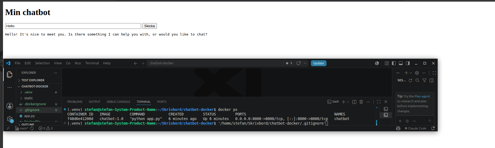
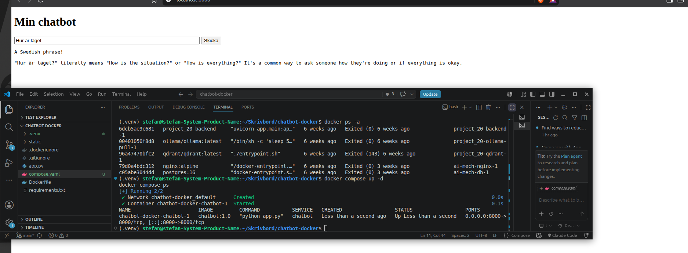
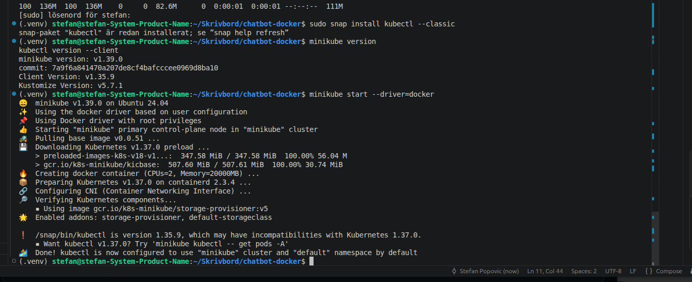
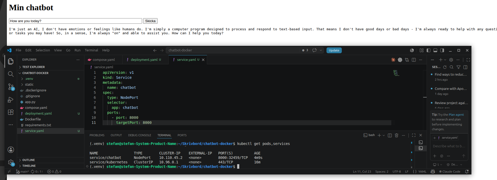

# Chatbot i Docker, Docker Compose och Kubernetes

En mycket enkel chatbot: en webbsida med en textruta och en liten Python-server som skickar frågan vidare till ett lokalt LLM (Ollama). Samma Docker-image körs på tre sätt: med `docker run`, med `docker compose` och i ett Kubernetes-kluster med en nod (minikube).

## Så fungerar det

```
Webbläsare  -->  Flask-server (container, port 8000)  -->  Ollama (på datorn, port 11434)
```

1. Webbläsaren hämtar sidan från `/`.
2. När man klickar på Skicka postas frågan till `/chat`.
3. Servern skickar frågan till Ollamas OpenAI-kompatibla API (`/v1/chat/completions`) och returnerar svaret.

Adressen till LLM:et och modellnamnet läses från miljövariabler, så samma image fungerar i alla tre miljöerna:

| Variabel | Standardvärde | Betydelse |
|---|---|---|
| `LLM_URL` | `http://localhost:11434/v1/chat/completions` | Adress till LLM-API:et |
| `LLM_MODEL` | `llama3:latest` | Modell som ska användas |

## Filer

| Fil | Innehåll |
|---|---|
| `app.py` | Flask-servern |
| `static/index.html` | Webbsidan |
| `requirements.txt` | Python-bibliotek (`flask`, `requests`) |
| `Dockerfile` | Bygger imagen från `python:3.12-slim` |
| `.dockerignore` | Håller `.venv` utanför imagen |
| `compose.yaml` | Konfiguration för Docker Compose |
| `deployment.yaml` | Kubernetes Deployment (en pod) |
| `service.yaml` | Kubernetes Service (gör podden nåbar) |

## Förutsättningar

- Linux med Docker Engine, samt tilläggen `buildx` och `compose`
- Ollama med modellen `llama3:latest`
- För del c: `minikube` och `kubectl`

### Ollama måste lyssna utåt

En container har ett eget nätverk, så `localhost` i containern är inte datorn. Ollama lyssnar som standard bara på `127.0.0.1` och måste därför ställas om:

```bash
sudo systemctl edit ollama
```

Lägg till:

```
[Service]
Environment="OLLAMA_HOST=0.0.0.0"
```

```bash
sudo systemctl restart ollama
```

Återställ efteråt med `sudo systemctl revert ollama` och starta om tjänsten.

## Bygg imagen

```bash
docker build -t chatbot:1.0 .
```

## a) Köra med Docker

```bash
docker run -d --name chatbot -p 8000:8000 \
  --add-host=host.docker.internal:host-gateway \
  -e LLM_URL=http://host.docker.internal:11434/v1/chat/completions \
  -e LLM_MODEL=llama3:latest \
  chatbot:1.0
```

Öppna http://localhost:8000.

Stäng av:

```bash
docker stop chatbot
docker rm chatbot
```

## b) Köra med Docker Compose

```bash
docker compose up -d
docker compose ps
```

Öppna http://localhost:8000.

Stäng av:

```bash
docker compose down
```

## c) Köra i Kubernetes (minikube)

Starta klustret och kontrollera noden:

```bash
minikube start --driver=docker
kubectl get nodes
```

Ladda in imagen i klustret och starta chatboten:

```bash
minikube image load chatbot:1.0
kubectl apply -f deployment.yaml -f service.yaml
kubectl get pods,services
```

Öppna en tunnel till tjänsten:

```bash
kubectl port-forward service/chatbot 8000:8000
```

Öppna http://localhost:8000. Tunneln stängs med `Ctrl+C`.

Stäng av:

```bash
kubectl delete -f service.yaml -f deployment.yaml
minikube stop
```

I klustret når podden datorn via namnet `host.minikube.internal`, som är satt i `deployment.yaml`.

## Screenshots

### a) Docker



### b) Docker Compose



### c) Kubernetes

Klustret startar:



Chatboten körs i klustret:



## Felsökning

| Symptom | Orsak och lösning |
|---|---|
| Sidan laddas men frågan fastnar på "Tänker..." | Containern når inte Ollama. Kontrollera med `ss -tln \| grep 11434` att Ollama lyssnar på `0.0.0.0`. |
| Samma symptom med `ufw` påslaget | Brandväggen blockerar containernätverket. Tillåt det mot port 11434. |
| `ErrImageNeverPull` i Kubernetes | Imagen finns inte i klustret. Kör `minikube image load chatbot:1.0`. |
| Port 8000 är upptagen | En tidigare container eller tunnel kör fortfarande. Kontrollera med `docker ps -a`. |
